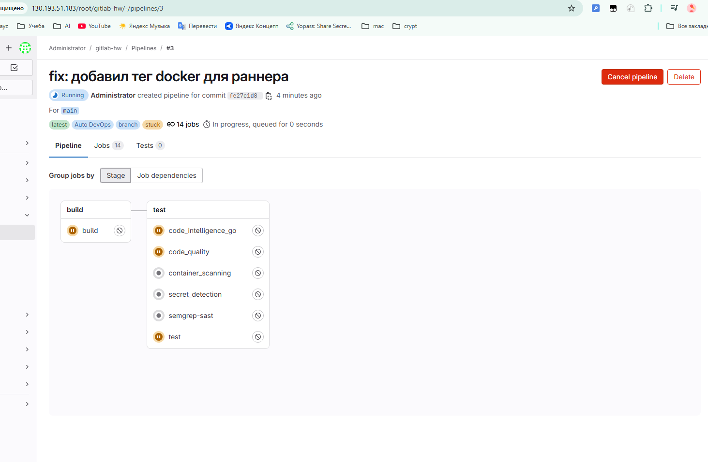

# Домашнее задание к занятию "`GitLab`" — Котенков Роман Алексеевич

[Руководство по оформлению Markdown файлов](https://gist.github.com/Jekins/2bf2d0638163f1294637#Code)

---

### Задание 1

**Что нужно сделать:**

1. Разверните GitLab локально, используя `Vagrantfile` и инструкцию из [репозитория](https://github.com/netology-code/sdvps-materials/tree/main/gitlab).  
2. Создайте новый проект и пустой репозиторий в нём.  
3. Зарегистрируйте `gitlab-runner` для проекта и запустите его в режиме `Docker`.  
   Раннер можно запускать на той же виртуальной машине, где установлен GitLab.

**Ответ на задание 1:**

Скриншот успешно зарегистрированного раннера:

---

### Задание 2

**Что нужно сделать:**

1. Запушьте [репозиторий](https://github.com/netology-code/sdvps-materials/tree/main/gitlab) на GitLab, изменив `origin`.  
2. Создайте `.gitlab-ci.yml`, описав в нём этапы `test` и `build`.

**Ответ на задание 2:**

Добавлен `.gitlab-ci.yml` с базовым CI/CD пайплайном:

**C тегами**
stages:
  - test
  - build

test:
  stage: test
  image: golang:1.17
  tags:
    - docker
  script:
    - go test .

build:
  stage: build
  image: docker:latest
  tags:
    - docker
  script:
    - docker build .

